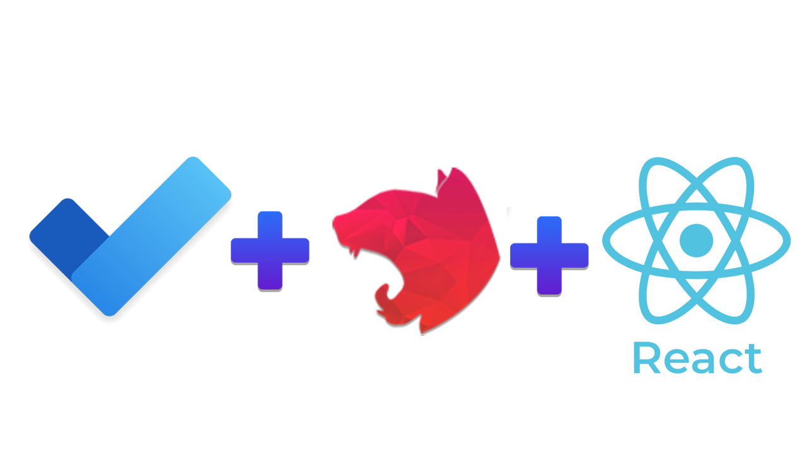

  <p align="center">A<a href="http://nodejs.org" target="_blank"> Todo App</a> Written with NestJs And Integragted with React Front-End</p>
    <p align="center">
<a href="https://www.npmjs.com/~nestjscore" target="_blank"></a>
<a href="https://www.npmjs.com/~nestjscore" target="_blank"></a>
<a href="https://www.npmjs.com/~nestjscore" target="_blank"></a>
<a href="https://circleci.com/gh/nestjs/nest" target="_blank"></a>
<a href="https://coveralls.io/github/nestjs/nest?branch=master" target="_blank"></a>
<a href="https://discord.gg/G7Qnnhy" target="_blank"></a>
<a href="https://opencollective.com/nest#backer" target="_blank"></a>
<a href="https://opencollective.com/nest#sponsor" target="_blank"></a>
  <a href="https://paypal.me/kamilmysliwiec" target="_blank"></a>
    <a href="https://opencollective.com/nest#sponsor"  target="_blank"></a>
  <a href="https://twitter.com/nestframework" target="_blank"></a>
</p>
  <!--[](https://opencollective.com/nest#backer)
  [](https://opencollective.com/nest#sponsor)-->

## NestJs Configuration

Live At https://todo.afaqjaved.com

```
Provide Postgres Parameters
in .local.env file accordingly :

DATABASE_HOST
DATABASE_PORT
DATABASE_USERNANE
DATABASE_PASSWORD
DATABASE_NAME
```

## NestJs Install Dependencies

```bash
$ npm install
```

## Run NestJs (Default Port is 3000)

```bash
# development
$ npm run start

# watch mode
$ npm run start:dev

# production mode
$ npm run start:prod
```

## React Install Dependencies

```bash
$ npm install
```

## Run React App (Default Port is 4000)

```
npm run dev
```


# Support By Subscribing [Notezz](https://www.youtube.com/channel/UC8DETz-dfBr_xkotFcNu5tQ).

## Stay in touch

- Author - Afaq Javed
- Website - [https://afaqjaved.com]
